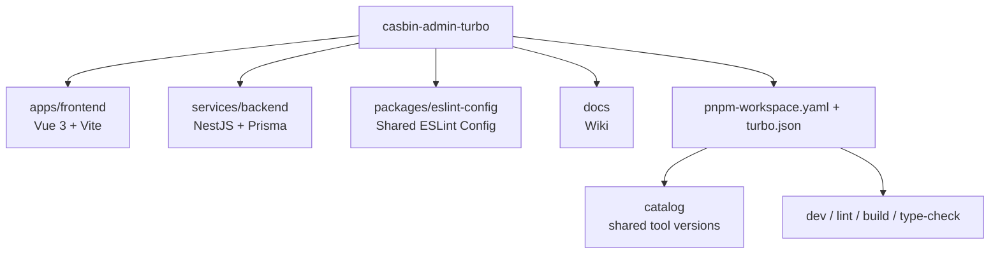
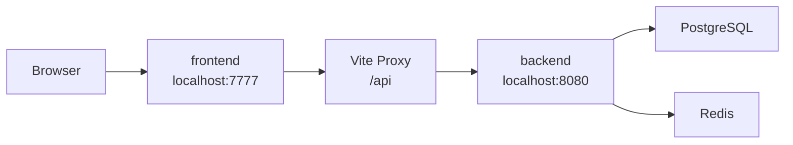

# 架构总览

## 结构图

## 仓库结构

- `apps/frontend`: Vue 3 管理端
- `services/backend`: NestJS 服务端
- `packages/eslint-config`: 共享 ESLint 配置
- 根目录通过 `pnpm workspace + turbo` 管理任务和依赖

## 工程化设计

- 使用单一 `pnpm-lock.yaml`
- 通过 `pnpm-workspace.yaml` 管理 workspace 和 `catalog`
- 通过 `turbo.json` 统一编排 `build`、`lint`、`type-check`、`dev`
- 通过 `packages/eslint-config` 统一 ESLint 基础规则，前后端各自保留局部覆写

## 前后端关系

- frontend 默认运行在 `http://localhost:7777`
- backend 默认运行在 `http://localhost:8080`
- frontend 通过 `VITE_PROXY` 将 `/api` 请求代理到 backend

## 未来可扩展方向

- 新增共享配置包，例如 `packages/tsconfig`
- 当多个服务共用数据库能力时，再考虑抽离独立的数据库基础设施包
- 当共享类型和 API 契约稳定后，再考虑抽取 `shared types` 或 SDK 包
