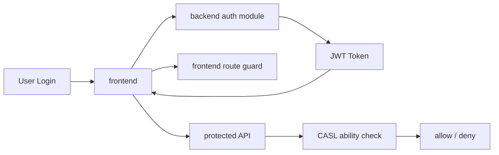

# 认证与权限

## 认证与权限流程图

## 当前能力

- backend 使用 JWT 鉴权
- backend 集成 CASL 权限控制
- frontend 具备登录鉴权、动态路由、权限页面控制能力

## 推荐补充内容

后续可以在这篇文档里逐步完善以下内容：

- 登录流程与 token 生命周期
- 刷新 token 策略
- 角色、权限、菜单之间的关系
- CASL 能力建模方式
- frontend 路由与按钮级权限控制方式
- 超级管理员与普通角色的差异

## 当前参考位置

- frontend: `apps/frontend/src/router/`, `apps/frontend/src/stores/`
- backend: `services/backend/src/app/system/auth/`, `services/backend/src/app/library/casl/`
