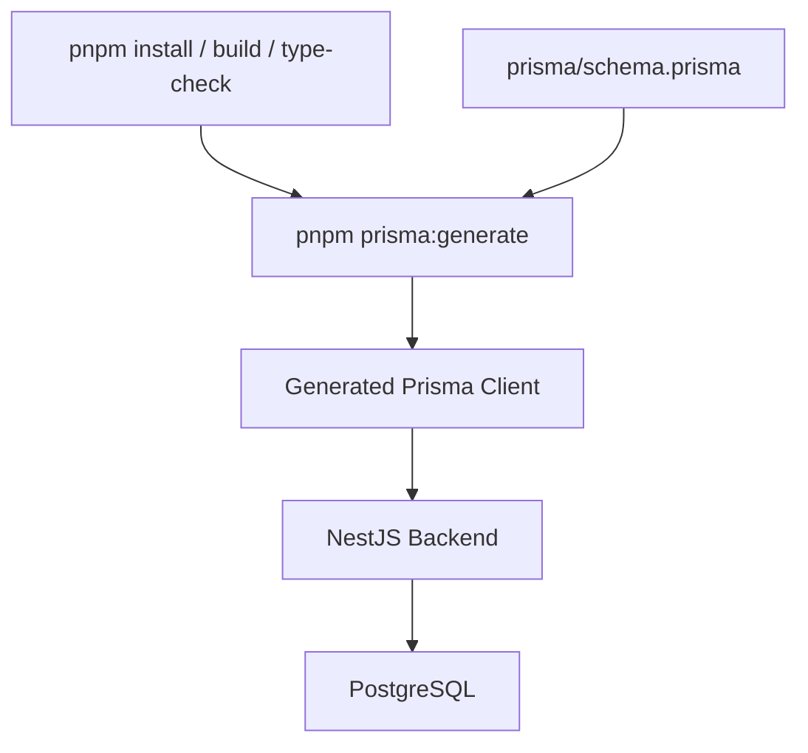

# 数据库与 Prisma

## Prisma 链路图



## 当前策略

- Prisma schema 保留在 `services/backend/prisma/schema.prisma`
- Prisma Client 由 backend 在安装、构建、类型检查前自动生成
- 当前不单独抽 `packages/prisma`，因为数据库能力仍只被 backend 使用

## 常用命令

```bash
pnpm --filter @casbin-admin/backend prisma:generate
pnpm --filter @casbin-admin/backend exec prisma migrate deploy
pnpm --filter @casbin-admin/backend exec prisma migrate dev
pnpm --filter @casbin-admin/backend exec prisma studio
```

## 环境变量

- 本地数据库连接由 `services/backend/.env` 中的 `DATABASE_URL` 控制

## 迁移约定

- 结构变更优先通过 Prisma migration 管理
- 提交数据库结构变更时，应同步提交对应 migration
- 不建议通过手工 SQL 修改生产结构后再回填 schema

## 后续何时考虑抽包

仅当以下场景出现时再考虑抽离数据库基础设施包：

- 多个服务需要直接访问同一份数据库 schema
- 需要共享 Prisma client、seed、迁移能力
- monorepo 中新增 worker / api / task 等多个后端服务
