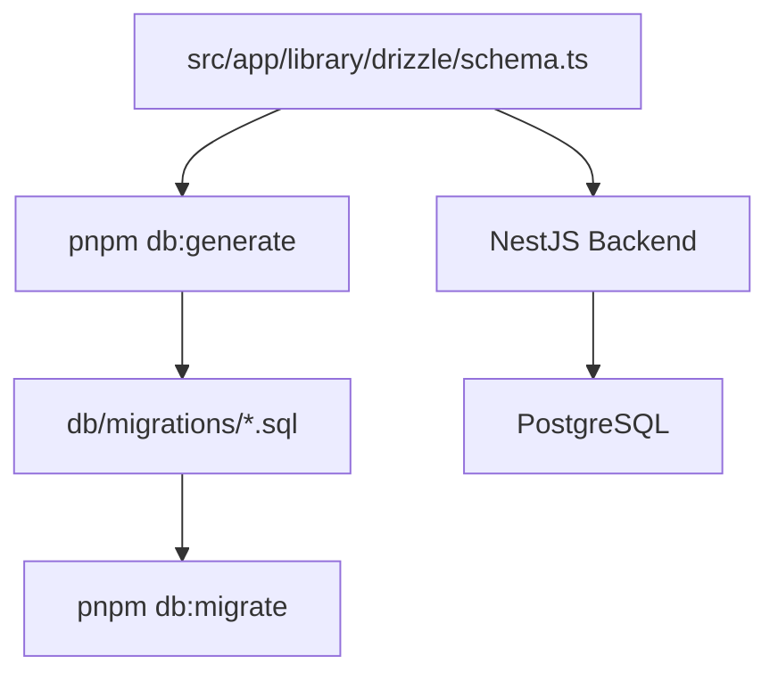

# 数据库与 Drizzle Tooling

## Schema 与迁移链路图



## 当前策略

- 数据库 schema 以 `services/backend/src/app/library/drizzle/schema.ts` 为唯一源头
- 迁移 SQL 位于 `services/backend/db/migrations`
- 使用项目内置 migration runner 执行 SQL 迁移
- 运行时 ORM 与 schema 工具链都已统一为 Drizzle
- 当前不单独抽数据库基础设施包，因为数据库能力仍只被 backend 使用

## 常用命令

```bash
pnpm --filter @casbin-admin/backend db:generate
pnpm --filter @casbin-admin/backend db:migrate
pnpm --filter @casbin-admin/backend db:migrate:status
pnpm --filter @casbin-admin/backend db:seed
pnpm --filter @casbin-admin/backend drizzle:studio
```

## 环境变量

- 本地数据库连接由 `services/backend/.env` 中的 `DATABASE_URL` 控制

## 迁移约定

- 结构变更优先通过 Drizzle schema + SQL migration 管理
- 提交数据库结构变更时，应同步提交对应 migration
- 不建议通过手工 SQL 修改生产结构后再回填 schema

## 后续何时考虑抽包

仅当以下场景出现时再考虑抽离数据库基础设施包：

- 多个服务需要直接访问同一份数据库 schema
- 需要共享 schema、seed、迁移能力
- monorepo 中新增 worker / api / task 等多个后端服务
