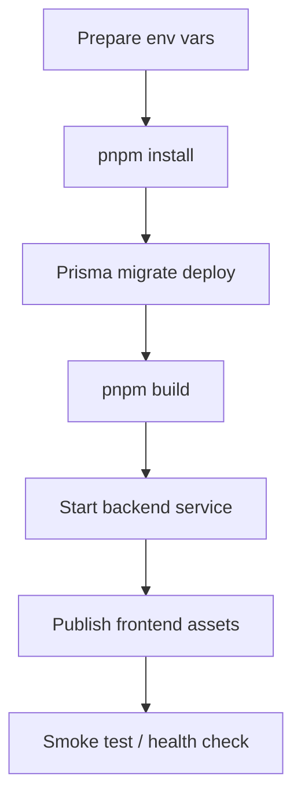

# 部署说明

## 部署流程图

## 当前状态

本仓库已完成本地 monorepo 工程化整理，但部署文档尚未完全展开。

## 后续建议补充内容

- 前端构建产物发布方式
- 后端环境变量清单
- 数据库迁移执行顺序
- Redis / PostgreSQL 依赖准备
- CI/CD 流程
- 回滚方案

## 基本部署顺序建议

1. 安装依赖：`pnpm install`
2. 配置后端环境变量
3. 执行 Prisma migration
4. 执行 `pnpm build`
5. 启动后端服务
6. 发布前端静态资源
