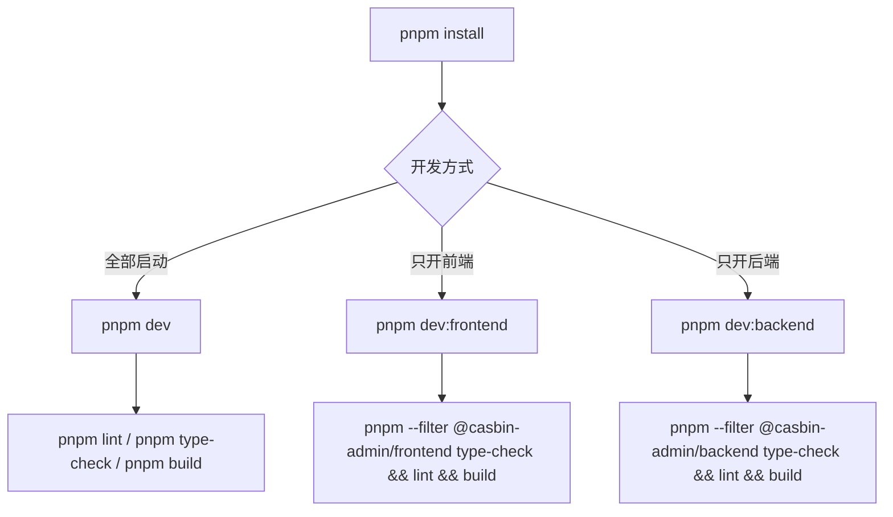

# 开发指南

## 开发流程图



## 环境要求

- Node.js: `^20.19.0 || >=22.12.0`
- pnpm: `10.x`

## 安装依赖

```bash
pnpm install
```

## 启动开发环境

```bash
pnpm dev
```

单独启动：

```bash
pnpm dev:frontend
pnpm dev:backend
```

## 常用命令

```bash
pnpm lint
pnpm lint:fix
pnpm type-check
pnpm build
pnpm format
pnpm format:check
```

## 按工作区执行命令

```bash
pnpm --filter @casbin-admin/frontend <script>
pnpm --filter @casbin-admin/backend <script>
```

## 开发约定

- 优先在根目录执行统一命令
- 共享工具链版本优先收敛到 `pnpm-workspace.yaml` 的 `catalog`
- 不要在子项目内保留独立锁文件
- 不要随意把 app 专属逻辑抽到 `packages/`

## 提交前建议检查

前端：

```bash
pnpm --filter @casbin-admin/frontend type-check
pnpm --filter @casbin-admin/frontend lint
pnpm --filter @casbin-admin/frontend build
```

后端：

```bash
pnpm --filter @casbin-admin/backend type-check
pnpm --filter @casbin-admin/backend lint
pnpm --filter @casbin-admin/backend build
```
